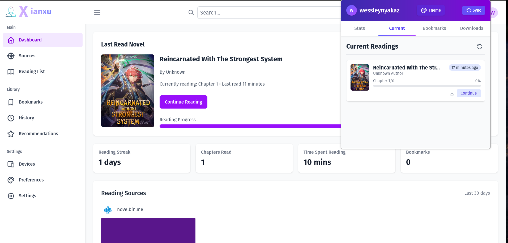

# Xianxu (xianxia-novel-bot)

   

## Features

- Monitors reading habits and preferences
- Analyzes completed novels for theme, pacing, and style
- Provides personalized recommendations for new webnovels
- Supports popular xianxia, wuxia, and xuanhuan genres
- Integration with popular webnovel platforms

## How It Works

The bot uses natural language processing and machine learning algorithms to:

1. Analyze the content and themes of novels you've read
2. Track your reading speed and completion rates
3. Identify patterns in your genre preferences
4. Match your profile with similar readers to find highly relevant recommendations

## Supported Platforms

- novelbin.me
